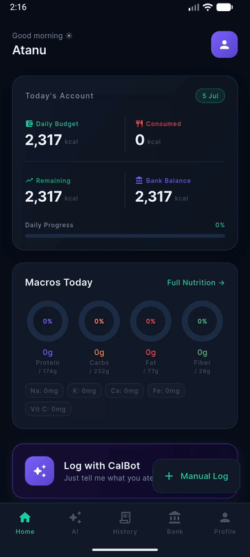
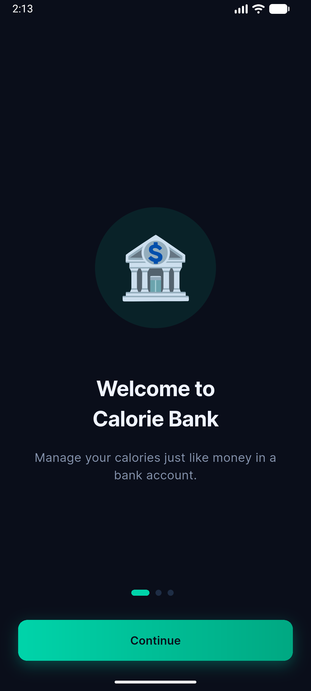
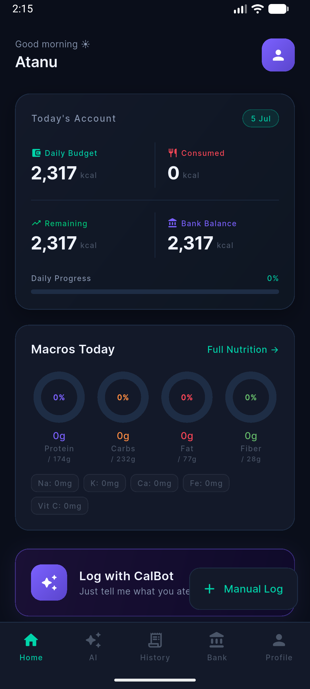
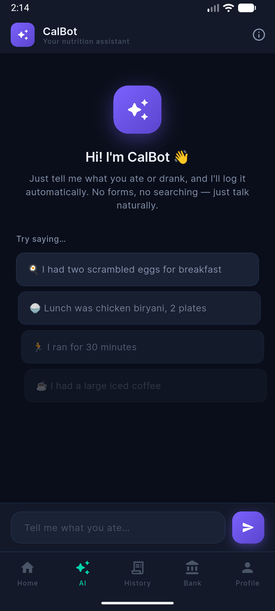
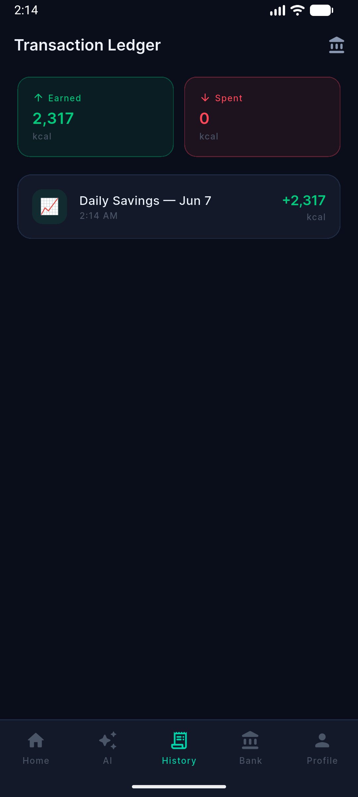
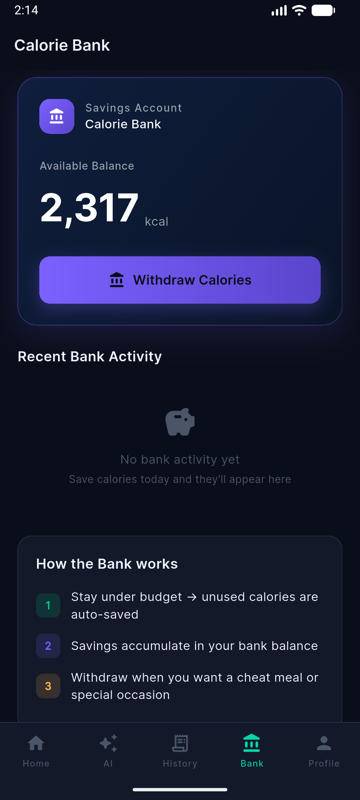
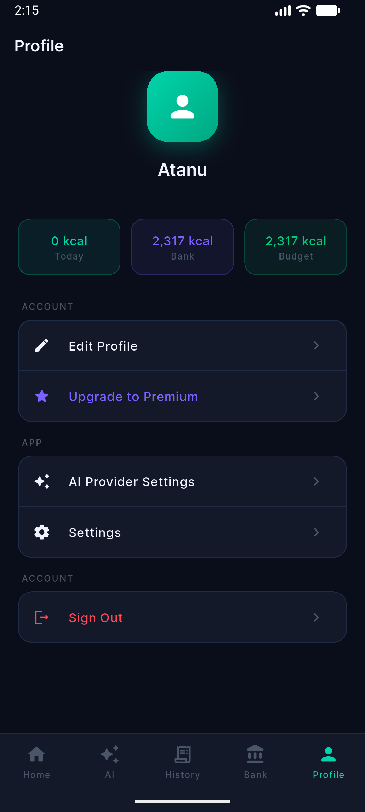

# Calorie Bank 🏦🔥

> Treat your calories like money — save, spend, and grow your daily calorie budget like a bank account.

> [!WARNING]
> **This project is abandoned / archived.** Development has moved to a native **Kotlin (Android)** rewrite: **[calorie-bank-kotlin](https://github.com/atanuroy911/calorie-bank-kotlin)**. This Flutter codebase is kept for reference and is not receiving further updates. See [Project status](#project-status) below.

📄 **[View the full project showcase (GitHub Pages)](https://atanuroy911.github.io/calorie-bank-app/)** *(enable GitHub Pages: Settings → Pages → source `main` / `/docs`)*



## Concept

Calorie Bank reframes calorie tracking using a banking metaphor:

- Your daily calorie budget is your **Daily Budget** (income).
- Food you log is **Consumed** (spending).
- Calories you don't eat are automatically **saved** into your **Bank Balance**.
- Save up across days, then **withdraw** saved calories for a cheat meal or special occasion.
- An AI assistant, **CalBot**, lets you log food/exercise conversationally ("I had two scrambled eggs for breakfast") instead of manually searching a food database.

## Screenshots

| Onboarding | Home Dashboard | CalBot AI Chat |
|---|---|---|
|  |  |  |

| Transaction Ledger | Calorie Bank | Profile |
|---|---|---|
|  |  |  |

More screenshots are available in [`docs/assets/screenshots/`](docs/assets/screenshots/).

## Features

- **Home dashboard** — daily budget, calories consumed, remaining balance, bank balance, and macro breakdown (protein/carbs/fat/fiber + micronutrients) at a glance.
- **CalBot AI logging** — describe meals or workouts in natural language; powered by Google's Generative AI (Gemini).
- **Manual entry** — food, exercise, and bank-withdrawal forms for when you'd rather not use AI.
- **Calorie Bank** — save unused calories automatically, withdraw them later; explains the "how it works" mechanic in-app.
- **Transaction ledger** — history of everything earned (saved) and spent (withdrawn).
- **Profile & settings** — editable profile, configurable AI provider, premium upsell screen.
- **Onboarding flow** — intro carousel + guided profile/goal setup, gated via `go_router` redirects based on auth/onboarding state stored in local preferences.

## Tech stack

- **Flutter** (Dart SDK ^3.5.0)
- **State management:** [flutter_riverpod](https://pub.dev/packages/flutter_riverpod)
- **Routing:** [go_router](https://pub.dev/packages/go_router) with a `ShellRoute` bottom-nav shell and auth/onboarding redirect guards
- **Local persistence:** `sqflite` (SQL), `shared_preferences`, `flutter_secure_storage`
- **Networking:** `dio`
- **AI:** `google_generative_ai` (Gemini) for the CalBot conversational logger
- **UI:** `google_fonts`, `flutter_animate`, `fl_chart` for macro/nutrition charts

### Architecture

The codebase follows a clean/layered structure:

```
lib/
├── app/            # App shell, theming, router
├── core/           # Constants, DI providers, extensions, utils (e.g. calorie calculator)
├── data/           # Datasources (local: sqflite/prefs, remote: AI/backend), models, repository impls
├── domain/         # Entities and repository interfaces
└── presentation/   # Feature screens (home, chat, bank, profile, onboarding, ...) + Riverpod providers
```

## Project status

This app was built as a Flutter proof-of-concept for the "calorie bank" idea. Going forward, active development continues in a **native Kotlin/Android** version — **[atanuroy911/calorie-bank-kotlin](https://github.com/atanuroy911/calorie-bank-kotlin)** — so:

- No further features or bug fixes are planned for this Flutter codebase.
- It remains here as a reference implementation and for its documented UI/UX.
- Feel free to fork or borrow ideas, but don't expect updates or support.

## Getting started (if you want to run it anyway)

```bash
flutter pub get
flutter run
```

Requires a configured Gemini API key for the AI (CalBot) features — see `lib/core/constants/api_constants.dart` and `lib/data/datasources/remote/ai_datasource.dart`.
